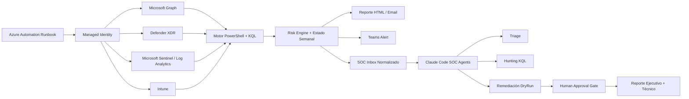

<div align="center">

# Alertas SOC AI Powered M365

### Automatización SOC para Microsoft 365, Entra ID, Defender, Sentinel e Intune


Un proyecto para convertir señales dispersas de Microsoft 365 en reportes, alertas accionables y playbooks asistidos por IA, pensado para administradores que necesitan operar seguridad con poco equipo y mucha automatización.

</div>

---

## Visión General

**Alertas SOC AI Powered M365** es un toolkit de automatización SOC para entornos Microsoft 365 / Entra ID. Combina reglas deterministas, consultas KQL, Microsoft Graph, Defender XDR, Sentinel, Intune y una capa opcional de IA para generar:

- reportes semanales de postura y amenazas;
- alertas críticas deduplicadas;
- análisis ejecutivo y técnico;
- playbooks de respuesta a incidentes;
- flujos asistidos por agentes para triage, hunting, scoring y remediación controlada.

El objetivo es tener a mano una orquestacion de alertas automatizada en canales de Microsoft Teams sin tener que utilizar capas de alertas extra con sistemas de terceros. solo utilizar lo que esta el stack de microsoft 365 a bajo costo.

## Para Quién Es

Este proyecto está pensado para:

| Perfil | Necesidad |
|---|---|
| Administradores Microsoft 365 | Centralizar señales de seguridad sin montar un SOC completo. |
| Equipos IT chicos | Automatizar reportes, triage y respuesta inicial. |
| Consultores Modern Workplace | Mostrar postura, riesgos y mejoras con evidencia. |
| Entornos cloud-only | Operar Entra ID, Defender, Sentinel e Intune sin Active Directory on-premises. |
| Laboratorios y portfolio | Demostrar diseño de automatización SOC con IA y Microsoft Security. |

## Qué Resuelve

| Problema | Respuesta del proyecto |
|---|---|
| Las alertas llegan dispersas | Normaliza señales desde Sentinel, Defender XDR, Entra ID e Intune. |
| El reporte semanal toma tiempo | Genera un informe estructurado con postura, amenazas y prioridades. |
| Las alertas se repiten | Usa firma de estado para no notificar lo mismo una y otra vez. |
| Falta contexto para decidir | Enriquece con riesgo, entidades, tendencias y evidencia. |
| La IA puede ser riesgosa tomando decisiones | La IA analiza y propone; las acciones sensibles quedan con aprobación humana. |
| Hay que responder incidentes | Incluye agentes y playbooks para triage, hunting, forense y remediación DryRun. |

## Arquitectura



## Capas Del Proyecto

### 1. Runbook desatendido

Ubicado en `src/`, corre en Azure Automation con Managed Identity.

Responsabilidades:

- consultar Microsoft Graph, Defender XDR, Sentinel, Log Analytics e Intune;
- calcular tendencias y deltas semanales;
- detectar eventos críticos;
- generar reportes y alertas;
- persistir estado para comparación y deduplicación.

### 2. Agentes SOC asistidos por IA

Ubicados en `.claude/agents/` y `agents-soc/`.

Responsabilidades:

- abrir casos SOC;
- clasificar falso positivo vs incidente real;
- generar KQL de expansión;
- revisar contexto de identidad/dispositivo;
- calcular severidad;
- preparar remediación en modo DryRun;
- registrar aprobación humana;
- documentar el cierre.

## Módulos

| Área | Módulo | Propósito |
|---|---|---|
| A | `A-Report` | Reporte semanal, alertas críticas, narrativa IA. |
| B | `B-Detection` | Incidentes, cobertura SOC, gaps de detección. |
| C | `C-Observability` | Identidad, endpoints, sign-ins, password spray, attack paths. |
| D | `D-ThreatIntel` | Tendencias, device-code phishing, cruce amenaza/cobertura. |
| E | `E-Hygiene` | Drift de configuración, higiene de datos, posture score. |
| F | `F-Engine` | Motor de riesgo y exportación de alertas normalizadas. |
| G | `G-Hunting` | Hunting de phishing, OAuth, privilegios y clicks sospechosos. |

## Estructura Del Repositorio

```text
alertas-soc-ai-powered-m365/
  config/
    settings.example.json
    crown-jewels.example.json

  src/
    Invoke-GeonosisSocAi.ps1
    modules/
    kql/
    templates/

  deploy/
    Deploy-GeonosisSocAi.ps1
    Grant-GraphRoles.ps1

  .claude/agents/
    soc-*.md

  agents-soc/
    playbooks/
    contracts/
    scoring/
    ingest/
    inbox/
    cases/

  docs/
    DOCUMENTACION.md
    Arquitectura-SOC-AI.png
```

## Inicio Rápido

### 1. Clonar el repositorio

```powershell
git clone https://github.com/pabloaverbuj/alertas-soc-ai-powered-m365.git
cd alertas-soc-ai-powered-m365
```

### 2. Crear configuración local

```powershell
Copy-Item .\config\settings.example.json .\config\settings.json
Copy-Item .\config\crown-jewels.example.json .\config\crown-jewels.json
```

### 3. Completar `config/settings.json`

Valores principales:

- `tenantId`
- workspace de Sentinel / Log Analytics
- subscription y resource group
- proveedor IA: Azure OpenAI o Anthropic
- destinatarios de email
- variable de webhook de Teams
- IPs corporativas confiables para reducir falsos positivos en password spray

### 4. Completar `config/crown-jewels.json`

Definir:

- cuentas break-glass;
- roles privilegiados;
- grupos Tier 0;
- service principals sensibles;
- recursos cloud críticos;
- endpoints de administración.

### 5. Desplegar Azure Automation

```powershell
.\deploy\Deploy-GeonosisSocAi.ps1 `
  -SubscriptionId "<subscription-id>" `
  -ResourceGroup "<resource-group>" `
  -AutomationAccount "aa-soc-ai" `
  -Location "brazilsouth" `
  -SkipGraph
```

### 6. Otorgar permisos Graph / Defender

Ejecutar desde una sesión limpia de PowerShell 7:

```powershell
pwsh -NoProfile -File .\deploy\Grant-GraphRoles.ps1 `
  -TenantId "<tenant-id>" `
  -MiObjectId "<managed-identity-object-id>"
```

### 7. Configurar Teams

```powershell
Set-AzAutomationVariable `
  -ResourceGroupName "<resource-group>" `
  -AutomationAccountName "aa-soc-ai" `
  -Name "GeonosisSocAi-TeamsWebhook" `
  -Value "<workflow-webhook-url>" `
  -Encrypted $true
```

## Proveedores IA

| Proveedor | Uso recomendado | Secreto requerido |
|---|---|---|
| Azure OpenAI | Producción con Managed Identity | No, usa identidad administrada. |
| Anthropic | Fallback o pruebas puntuales | Sí, variable `GeonosisSocAi-AnthropicKey`. |

La IA no ejecuta cambios por sí sola. Resume, prioriza, propone y prepara evidencias. Las acciones sensibles pasan por `DryRun` y aprobación humana.

## Agentes SOC

| Agente | Rol |
|---|---|
| `soc-casemanager` | Abre el caso y enruta el playbook. |
| `soc-triage-l1` | Determina falso positivo vs incidente real. |
| `soc-forense-l2` | Busca persistencia, MFA, OAuth, reglas y sesiones. |
| `soc-hunter-kql` | Genera consultas KQL de expansión. |
| `soc-intune-context` | Revisa postura del endpoint. |
| `soc-riskscorer` | Calcula severidad y confianza. |
| `soc-remediator` | Prepara remediación en modo DryRun. |
| `soc-approver` | Registra aprobación humana. |
| `soc-reporter` | Genera reporte ejecutivo y técnico. |
| `soc-posture-advisor` | Convierte incidentes repetidos en mejoras estructurales. |

Más detalle en [agents-soc/README.md](agents-soc/README.md).

## Modelo De Seguridad

- `config/settings.json` y `config/crown-jewels.json` son locales y no se versionan.
- `agents-soc/cases/` e `agents-soc/inbox/` contienen evidencia runtime y quedan fuera de Git.
- Las credenciales se guardan como variables cifradas de Azure Automation.
- Las remediaciones destructivas requieren aprobación humana.
- Los playbooks deben ejecutarse primero en `DryRun`.
- El proyecto prioriza lectura, análisis y trazabilidad antes que automatización agresiva.

## Requisitos

- PowerShell 7.2 o superior.
- Azure Automation con System-Assigned Managed Identity.
- Microsoft Sentinel o Log Analytics con tablas relevantes.
- Defender XDR y Microsoft Graph.
- Permisos de lectura sobre Identity Protection, Defender, Intune y Security.
- Opcional: Azure OpenAI con rol `Cognitive Services OpenAI User`.
- Opcional: Claude Code para usar los agentes interactivos.

## Estado Del Proyecto

El proyecto está en formato **scaffold operativo**: tiene módulos, runbook, documentación, ejemplos, playbooks y agentes. Antes de usarlo en producción, cada tenant debe ajustar:

- permisos;
- umbrales;
- destinatarios;
- crown jewels;
- privacidad de datos;
- procesos de aprobación;
- alcance de remediación.

## Documentación

- [Documentación técnica](docs/DOCUMENTACION.md)
- [Setup de Teams Webhook](docs/teams-webhook-setup.md)
- [Agentes SOC](agents-soc/README.md)
- [Guardrails de agentes](agents-soc/SHARED-GUARDRAILS.md)

## Nota

Este repositorio nace como un proyecto práctico de automatización SOC para Microsoft 365. Está pensado para ser útil, adaptable y transparente: que otros administradores puedan tomarlo, entenderlo, modificarlo y usarlo como base para madurar su propia operación de seguridad.
